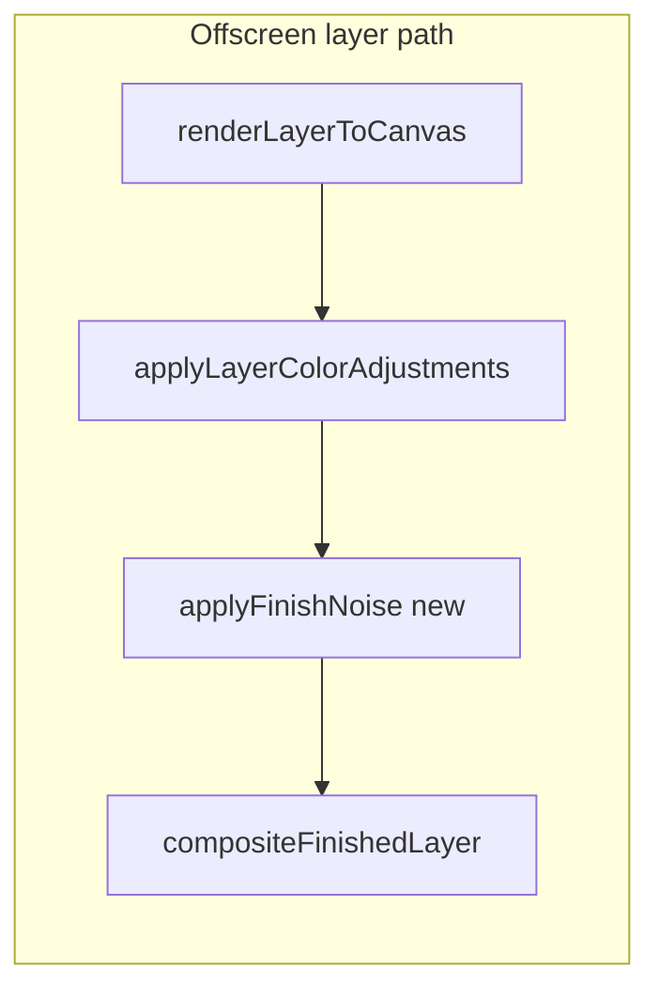

# Layer finish: Noise + monochromatic noise

## Do the libraries already provide this?

**No, not in the path you use today.**

- **Color controls (Saturate, Hue, etc.)** are implemented as a CSS filter string on a 2D canvas context, then `drawImage` in [`src/lib/render.ts`](src/lib/render.ts) (`buildFinishFilter` / `applyLayerColorAdjustments`). The [standard CSS filter functions](https://developer.mozilla.org/en-US/docs/Web/CSS/filter-function) do **not** include RGB or luminance noise/grain.
- **`pixi.js`** is in [`package.json`](package.json) but **is not referenced anywhere under `src/`**; rendering is **Canvas 2D** in [`src/lib/render.ts`](src/lib/render.ts). Third-party Pixi noise filters would not apply without replacing or duplicating this pipeline.
- **Practical approach:** add a short **ImageData** step after color adjustments (same pattern as existing `applySharpen` using `getImageData` / `putImageData` elsewhere in that file).

## Data model

- Extend [`FinishSettings`](src/types/project.ts) with two numbers, e.g. `noise` and `noiseMonochrome`, **default `0`**, range **`0..1`** (match other finish sliders).
- Wire defaults and migration in [`DEFAULT_FINISH`](src/lib/project-defaults.ts) and [`normalizeFinishSettings`](src/lib/project-defaults.ts) (same pattern as `grayscale` / `invert`).
- Old projects without these keys keep working via normalization.

## Rendering

- Add `applyFinishNoise(canvas, project)` in [`src/lib/render.ts`](src/lib/render.ts):
  - Early-out if both strengths are 0.
  - Read `ImageData`, loop pixels; **skip (or nearly skip) transparent pixels** so only drawn layer content is grained, matching “shapes of the layer.”
  - **Colored noise:** independent offsets for R/G/B (three draws from a PRNG per pixel, or two if you fold alpha).
  - **Monochromatic noise:** one offset applied to R, G, and B.
  - Combine contributions (e.g. additive) and **clamp** to 0–255. Scale slider 1.0 to a sensible max delta (e.g. on the order of tens of levels, tunable once you eyeball in the UI).
- **Determinism:** use a **single** `mulberry32` instance from [`src/lib/rng.ts`](src/lib/rng.ts) seeded from `project.activeSeed`, `hashToSeed(layerId)` (pass `layer.id` into the render project or seed only from `activeSeed` + constant if layer id is awkward—prefer layer id + activeSeed so two layers match layout but grain differs). Advance the RNG in **fixed scanline order** over non-transparent pixels so exports are stable.
- Update [`hasActiveFinish`](src/lib/render.ts) so **noise &gt; 0** forces the existing offscreen path (same as shadows / brightness). Chain after `applyLayerColorAdjustments` and before `compositeFinishedLayer` in [`renderCompositorLayer`](src/lib/render.ts):

  `finishedLayerCanvas = applyFinishNoise(applyLayerColorAdjustments(...), layerProject)`.

  If noise is the **only** “finish” and opacity is 1 / `source-over`, this keeps behavior correct (today `usesDirectComposite` skips any finish).

## UI

- In [`src/features/editor/right-sidebar.tsx`](src/features/editor/right-sidebar.tsx), add two `SliderField`s after Hue Rotate (or after Invert—your call), labels **Noise** and **Monochromatic noise**, `min={0}`, `max={1}`, `step={0.01}`, `formatter={formatPercentValue}` to match neighbors.

## Tests

- [`src/lib/project-defaults.test.ts`](src/lib/project-defaults.test.ts): expect new defaults on `finish`.
- [`src/lib/render.test.ts`](src/lib/render.test.ts): assert that with fixed project + seed, enabling noise changes pixel output vs baseline (or compare checksum of a tiny canvas), without brittle full-string CSS assertions.
- [`src/lib/serializer.test.ts`](src/lib/serializer.test.ts): if fixtures embed full `finish` objects, add the new keys so equality checks still pass.

## Optional cleanup (out of scope unless you want it)

- Remove unused `pixi.js` dependency to avoid implying a Pixi-based render path; only if you confirm nothing external relies on it.
